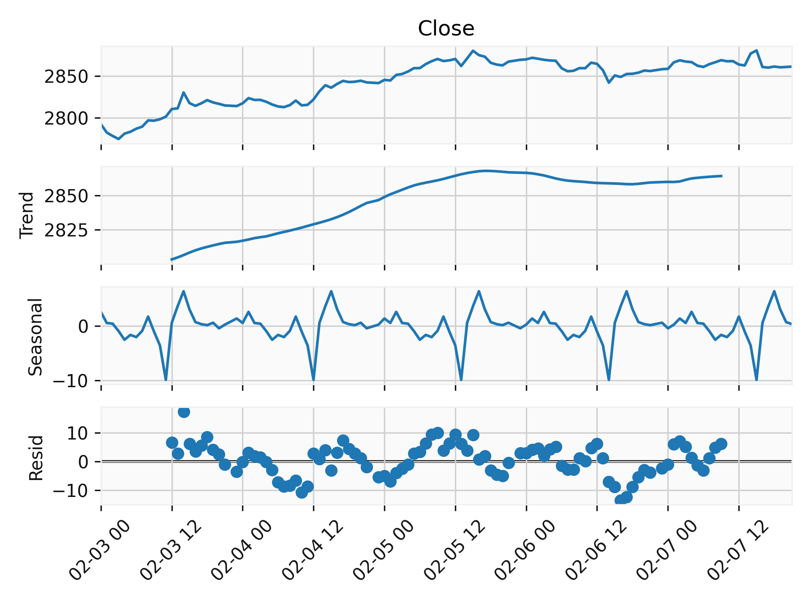

# Automate Gold Report

## Description
This project automates the generation of financial market reports using OANDA data for multiple trading instruments.

## Features
- Automated data collection
- Report generation
- Data visualization

## Configuration
Update the `.env` file with your OANDA settings:
```bash
ACCESS_TOKEN=access_token
ACCOUNT_ID=account_id
```

## Example Usage & Results

Here's an example of the generated report visualizations:


*Figure 1: Gold price movements over time with technical indicators*



*Figure 2: Gold decomposition using trend, seasonal and residual*

These visualizations help track market trends and make informed trading decisions.

## License
MIT License

## Author
David Zhu